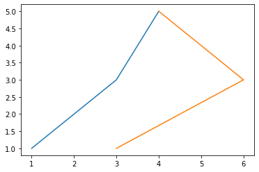
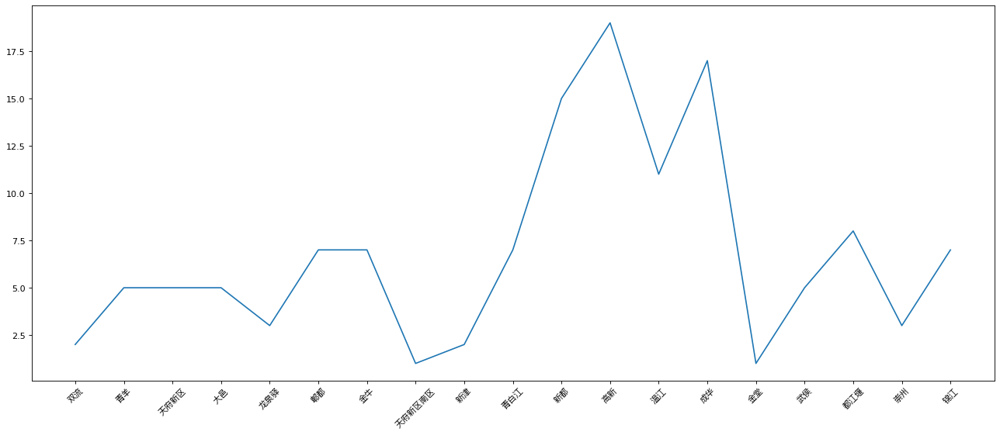
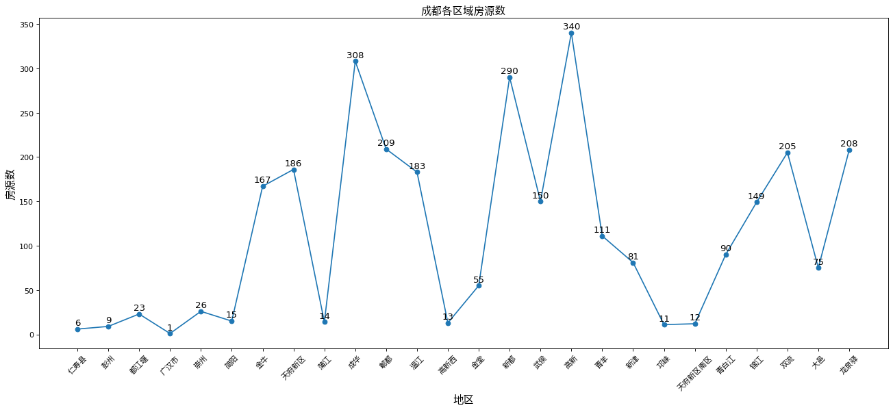
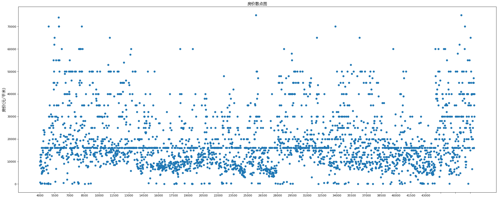
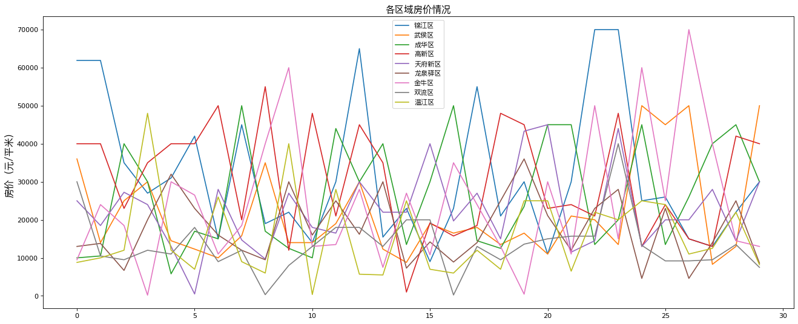
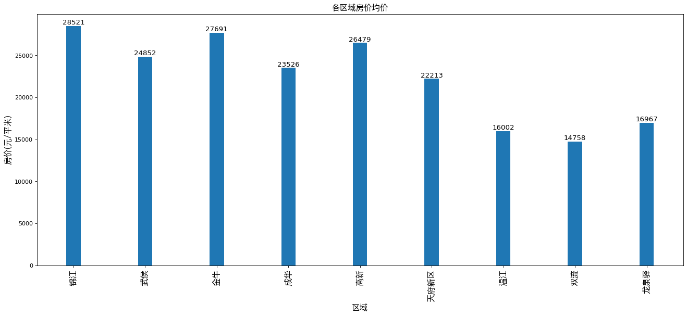

#test mongo-matplotlib-贝壳数据-文档


```python
#test
%matplotlib inline
import matplotlib.pyplot as plt
import numpy as np
x = np.array([[1,3],[3,6],[4,4]])
y = np.array([1,3,5])
plt.plot(x,y)
```


    [<matplotlib.lines.Line2D at 0x112bc4be0>,
     <matplotlib.lines.Line2D at 0x112bc4d30>]





##test2


```python
#test2
%matplotlib inline
import matplotlib.pyplot as plt
import numpy as np
from pymongo import MongoClient
from matplotlib import font_manager

#myfont让图标显示中文字体
my_font = font_manager.FontProperties(fname='/System/Library/Fonts/PingFang.ttc')
#实例化客户端
client = MongoClient(host='127.0.0.1', port=27017)
#绑定数据库
db = client.project
#绑定数据集合
collection = db['test']

#不同区域的小区总数并按区域分组的查找代码
pipeline= [{"$group":{"_id":'$district', "count":{'$sum':1}}}]

#plt.figure定义图表大小
plt.figure(figsize=(20,8), dpi=80)

#使用聚合查询
m = collection.aggregate(pipeline)
x=[]
y=[]
#查出来的数据标示不同轴
for i in m:
    x.append(i['_id'])
    y.append(i['count'])
print(x)
print(y)
#绘图
plt.plot(x,y)

#让x轴显示中文并倾斜45度
plt.xticks(rotation=45,fontproperties=my_font)
plt.show()
```

    ['双流', '青羊', '天府新区', '大邑', '龙泉驿', '郫都', '金牛', '天府新区南区', '新津', '青白江', '新都', '高新', '温江', '成华', '金堂', '武侯', '都江堰', '崇州', '锦江']
    [2, 5, 5, 5, 3, 7, 7, 1, 2, 7, 15, 19, 11, 17, 1, 5, 8, 3, 7]





##按区域划分，查看各区域房源数量


```python
#按区域划分，查看各区域房源数量
%matplotlib inline
import matplotlib.pyplot as plt
import numpy as np
from pymongo import MongoClient
from matplotlib import font_manager

#myfont让图标显示中文字体
my_font = font_manager.FontProperties(fname='/System/Library/Fonts/PingFang.ttc')
#实例化客户端
client = MongoClient(host='127.0.0.1', port=27017)
#绑定数据库
db = client.test
#绑定数据集合
collection = db['test']

#不同区域的小区总数并按区域分组的查找代码
pipeline= [{"$group":{"_id":'$district', "count":{'$sum':1}}}]

#plt.figure定义图表大小
plt.figure(figsize=(20,8), dpi=80)

#使用聚合查询
m = collection.aggregate(pipeline)
x=[]
y=[]
#查出来的数据标示不同轴
for i in m:
    x.append(i['_id'])
    y.append(i['count'])
print(x)
print(y)
#绘图
plt.scatter(x,y)#点状图
plt.plot(x,y)#线状图
for a,b in zip(x,y):#给每个点标上一个值
    plt.text(a,b+2,'%.0f'%b, ha='center', va='bottom',fontsize=12)

#让x轴显示中文并倾斜45度
plt.xticks(rotation=45,fontproperties=my_font)

plt.xlabel('地区',fontproperties=my_font,fontsize=14)#给不同轴命名
plt.ylabel('房源数',fontproperties=my_font,fontsize=14 )
plt.title('成都各区域房源数',fontproperties=my_font,fontsize=14)#给图标命名
plt.show()
```

    ['仁寿县', '彭州', '都江堰', '广汉市', '崇州', '简阳', '金牛', '天府新区', '蒲江', '成华', '郫都', '温江', '高新西', '金堂', '新都', '武侯', '高新', '青羊', '新津', '邛崃', '天府新区南区', '青白江', '锦江', '双流', '大邑', '龙泉驿']
    [6, 9, 23, 1, 26, 15, 167, 186, 14, 308, 209, 183, 13, 55, 290, 150, 340, 111, 81, 11, 12, 90, 149, 205, 75, 208]





##根据价格查看价格离散情况


```python
# 根据价格查看价格离散情况
%matplotlib inline
from matplotlib import font_manager
import matplotlib.pyplot as plt
basedir = '/Users/longzhi/Desktop/python基础2019/python高阶/爬虫/scrapys/lianjia/lianjia/data.csv'
my_font = font_manager.FontProperties(fname='/System/Library/Fonts/PingFang.ttc')

import numpy as np
import csv    #需要加载numpy和csv两个包
date_List = []
with open(basedir,'r') as f:#打开文件
    csv_reader_lines = csv.reader(f)    #用csv.reader读文件

    for one_line in csv_reader_lines:
        date_List.append(one_line)    #逐行将读到的文件存入python的列表
date_List = date_List[1:]
data_ndarray = np.array(date_List)    #将python列表转化为ndarray
# print(data_ndarray[0:3,5:7])    #切个片试一下是否成功
prices = data_ndarray[0:,5:6]
data = prices.astype("float")

newdata=[]
for i in data:
    if i == 0:
        i = data.mean()
    elif i >= 80000:
        continue
    newdata.append([i])
y = newdata
x = range(2929)

plt.figure(figsize=(30,12), dpi=80)
plt.scatter(x,y)#点状图

_x = list(x)[::100]
_xstick = [i+4000 for i in range(0,40000,1500)]
plt.xticks(_x,_xstick)

plt.ylabel('房价(元/平米)',fontproperties=my_font,fontsize=14 )
plt.title('房价散点图',fontproperties=my_font,fontsize=14)
plt.show()
```





##按区域划分，查看各区域房价分布图


```python
%matplotlib inline
import random
import matplotlib.pyplot as plt
import numpy as np
from pymongo import MongoClient
from matplotlib import font_manager

#myfont让图标显示中文字体
my_font = font_manager.FontProperties(fname='/System/Library/Fonts/PingFang.ttc')
#实例化客户端
client = MongoClient(host='127.0.0.1', port=27017)
#绑定数据库
db = client.test
#绑定数据集合
collection = db['test']

#不同区域的小区总数并按区域分组的查找代码
pipeline= [{"$group":{"_id":'$district', "count":{'$sum':1}}}]

#plt.figure定义图表大小
plt.figure(figsize=(20,8), dpi=80)

#使用查询
m = collection.find({},{"_id":0,"district":1,"price":1})
jinjiang = []
wuhou = []
gaoxin = []
jinniu = []
chenghua = []
tianfu = []
wenjiang = []
shuangliu = []
longquan = []


#查出来的数据标示不同轴
for i in m:
    if i['district'] == '锦江':
        if i['price'] != '0':
            jinjiang.append(float(i['price']))
    if i['district'] == '武侯':
        if i['price'] != '0':
            wuhou.append(float(i['price']))
    if i['district'] == '金牛':
        if i['price'] != '0':
            jinniu.append(float(i['price']))
    if i['district'] == '高新':
        if i['price'] != '0':
            gaoxin.append(float(i['price']))
    if i['district'] == '成华':
        if i['price'] != '0':
            chenghua.append(float(i['price']))
    if i['district'] == '天府新区':
        if i['price'] != '0':
            tianfu.append(float(i['price']))
    if i['district'] == '温江':
        if i['price'] != '0':
            wenjiang.append(float(i['price']))
    if i['district'] == '双流':
        if i['price'] != '0':
            shuangliu.append(float(i['price']))
    if i['district'] == '龙泉驿':
        if i['price'] != '0':
            longquan.append(float(i['price']))
    else:
        continue
#随机抽取30个建立y轴
y_jinj = random.sample(jinjiang,30)
y_wuh = random.sample(wuhou,30)
y_gaox = random.sample(gaoxin,30)
y_jinn = random.sample(jinniu,30)
y_chengh = random.sample(chenghua,30)
y_wenj = random.sample(wenjiang,30)
y_shuangl = random.sample(shuangliu,30)
y_longq = random.sample(longquan,30)
y_tianf = random.sample(tianfu,30)

#建立x轴
x = list(range(30))
# plt.scatter(x,y)#点状图
plt.plot(x,y_jinj,label='锦江区')
plt.plot(x,y_wuh, label='武侯区')
plt.plot(x,y_chengh,label='成华区')
plt.plot(x,y_gaox,label='高新区')
plt.plot(x,y_tianf,label='天府新区')
plt.plot(x,y_longq,label='龙泉驿区')
plt.plot(x,y_jinn,label='金牛区')
plt.plot(x,y_shuangl,label='双流区')
plt.plot(x,y_wenj,label='温江区')

#设置图例
plt.legend(prop= my_font)

# plt.xticks(rotation=45,fontproperties=my_font)

plt.ylabel('房价（元/平米）',fontproperties=my_font,fontsize=14 )
plt.title('各区域房价情况',fontproperties=my_font,fontsize=14)#给图标命名
plt.show()

```





#按区域划分，查看各区域均价


```python
%matplotlib inline
from matplotlib import font_manager
import matplotlib.pyplot as plt
basedir = '/Users/longzhi/Desktop/python基础2019/python高阶/爬虫/scrapys/lianjia/lianjia/data.csv'
my_font = font_manager.FontProperties(fname='/System/Library/Fonts/PingFang.ttc')

import numpy as np
import csv    #需要加载numpy和csv两个包
date_List = []
with open(basedir,'r') as f:#打开文件
    csv_reader_lines = csv.reader(f)    #用csv.reader读文件

    for one_line in csv_reader_lines:
        date_List.append(one_line)    #逐行将读到的文件存入python的列表
date_List = date_List[1:]
data_ndarray = np.array(date_List)    #将python列表转化为ndarray
# print(data_ndarray[0:3,5:7])    #切个片试一下是否成功

#取数据
prices = data_ndarray[0:,5:6]
prices = prices.astype("float")
district = data_ndarray[0:,2:3]

jinjiang = []
wuhou = []
gaoxin = []
jinniu = []
chenghua = []
tianfu = []
wenjiang = []
shuangliu = []
longquan = []

#把数据合并为同一个数组
data_arry = np.hstack((district,prices))

#按不同划分取数据
for data in data_arry:
    if data[0] == '锦江':
        if float(data[1]) != 0:
            jinjiang.append(data[1])
    if data[0] == '武侯':
        if float(data[1]) != 0:
            wuhou.append(data[1])
    if data[0] == '高新':
        if float(data[1]) != 0:
            gaoxin.append(data[1])
    if data[0] == '成华':
        if float(data[1]) != 0:
            chenghua.append(data[1])
    if data[0] == '金牛':
        if float(data[1]) != 0:
            jinniu.append(data[1])
    if data[0] == '天府新区':
        if float(data[1]) != 0:
            tianfu.append(data[1])
    if data[0] == '温江':
        if float(data[1]) != 0:
            wenjiang.append(data[1])
    if data[0] == '双流':
        if float(data[1]) != 0:
            shuangliu.append(data[1])
    if data[0] == '龙泉驿':
        if float(data[1]) != 0:
            longquan.append(data[1])
    else:
        continue

#把取出的数据转化成floa型
jinjiang= np.array(jinjiang).astype(float)
#取出的数据求均值
y_jinj = jinjiang.mean()
wuhou= np.array(wuhou).astype(float)
y_wuh = wuhou.mean()
jinniu= np.array(jinniu).astype(float)
y_jinn = jinniu.mean()
gaoxin= np.array(gaoxin).astype(float)
y_gaox = gaoxin.mean()
chenghua= np.array(chenghua).astype(float)
y_chengh = chenghua.mean()
tianfu= np.array(tianfu).astype(float)
y_tianf = tianfu.mean()
wenjiang= np.array(wenjiang).astype(float)
y_wenj = wenjiang.mean()
longquan= np.array(longquan).astype(float)
y_longq = longquan.mean()
shuangliu= np.array(shuangliu).astype(float)
y_shuangl = shuangliu.mean()
a = ['锦江','武侯', '金牛','成华','高新','天府新区','温江','双流','龙泉驿']

#建立x轴
x = list(range(len(a)))
#建立y轴
y = [y_jinj,y_wuh,y_jinn,y_chengh,y_gaox,y_tianf,y_wenj,y_shuangl,y_longq]

#设置图片大小
plt.figure(figsize=(20,8), dpi=80)

#绘制柱状图
plt.bar(x,y, width=0.2)
plt.xticks(x, a, fontproperties=my_font,rotation=90,fontsize=14)

plt.xlabel('区域',fontproperties=my_font,fontsize=14 )
plt.ylabel('房价(元/平米)',fontproperties=my_font,fontsize=14 )
plt.title('各区域房价均价',fontproperties=my_font,fontsize=14)
for a,b in zip(x,y):#给每个轴标上一个值
    plt.text(a,b+2,'%.0f'%b, ha='center', va='bottom',fontsize=12)
plt.show()
```





```python
import numpy as np

a = np.array([1,2,3]).reshape(1,3)
b = np.array([2,3,4]).reshape(1,3)

c = np.vstack((a,b))
              
print(c)
```

    [[1 2 3]
     [2 3 4]]


```python

```
